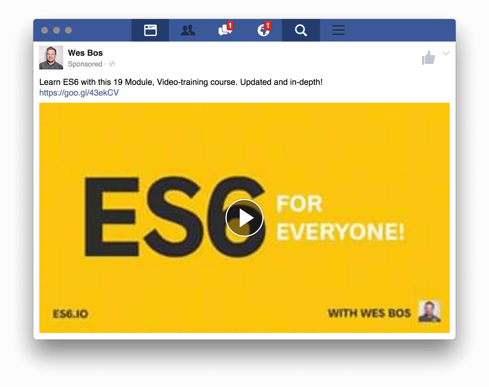

# Cutine 

> Simple Facebook Client for macOS

This app is based on the fast [Mobile Facebook](https://m.facebook.com) website, but modifies a lot of things and makes it more usable on the desktop.

 

	<a href="https://github.com/soul-wish/cutine/releases/latest" align="center">
		

## Features

### Background behavior

When closing the window, the app will continue running in the background, in the dock on macOS. Right-click the dock icon and choose `Quit` to completely quit the app. Click the dock icon to show the window.

### Keyboard shortcuts

- New message: <kbd>m</kbd>
- Go to Home: <kbd>g</kbd> <kbd>h</kbd>
- Go to Friends: <kbd>g</kbd> <kbd>f</kbd>
- Go to Messages: <kbd>g</kbd> <kbd>m</kbd>
- Go to Notifications: <kbd>g</kbd> <kbd>n</kbd>
- Go to Search: <kbd>g</kbd> <kbd>s</kbd>
- Go to Profile: <kbd>g</kbd> <kbd>p</kbd>
- Go to Likes: <kbd>g</kbd> <kbd>l</kbd>
- Go to Lists: <kbd>g</kbd> <kbd>i</kbd>
- Go to previous page: <kbd>Delete</kbd> or <kbd>←</kbd>
- Go to next page: <kbd>→</kbd>

## Install

### macOS

[**Download**](https://github.com/soul-wish/cutine/releases/latest), unzip, and move `Cutine.app` to the `/Applications` directory.

---

## Dev

Built with [Electron](http://electron.atom.io).

###### Commands

- Init: `$ npm install`
- Run: `$ npm start`
- Build macOS: `$ npm run build:macos`

## License

MIT © [Sergey Lysenko](http://soulwish.info)
